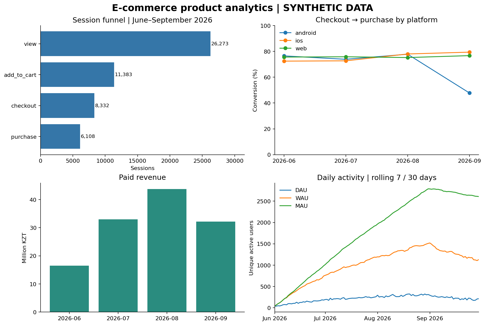
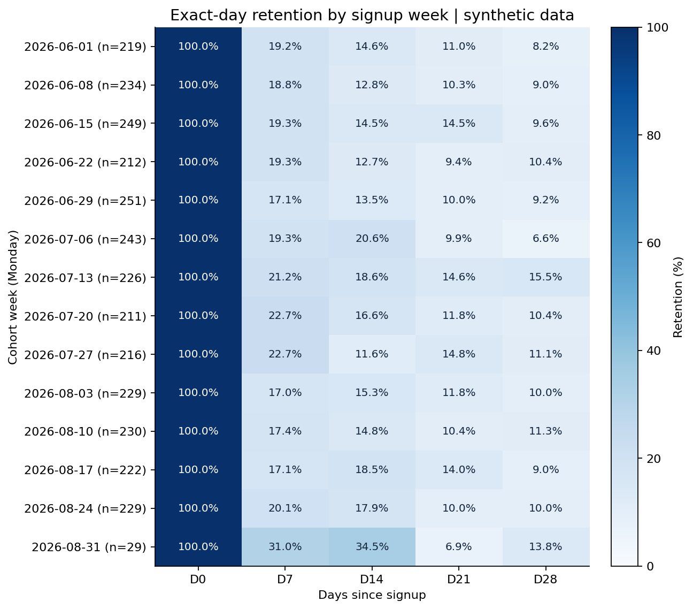

# E-commerce Product Analytics

Портфолио-кейс продуктового аналитика: диагностика падения конверсии в интернет-магазине.
**SQL + Python · 3 000 пользователей · 54 320 событий · июнь–сентябрь 2026**

Данные полностью **синтетические**. Это учебное исследование, а не результаты реального бизнеса.
Генератор содержит заранее заданную проблему оплаты в Android 2.1; анализ демонстрирует,
как найти её через воронку, сегментацию и события ошибок.

## Бизнес-задача

В сентябре команда заметила падение конверсии Android после обновления приложения.
Нужно определить проблемный этап, найти сегмент, оценить масштаб и предложить действия.
Дополнительно — описать активность, удержание и повторные покупки, чтобы видеть продукт целиком.

## Результат

| Метрика | Значение |
|---|---:|
| Конверсия сессии в покупку | 23,25% |
| Оплаченные заказы | 6 108 |
| Выручка за весь период | 125 364 615 ₸ |
| Средний чек | 20 525 ₸ |
| D7 retention — удержание на 7-й день | 19,40% |
| D30 retention — удержание на 30-й день | 9,93% |
| Повторная покупка за 30 дней | 57,51% |

Главный проблемный сегмент — **Android 2.1, checkout → purchase**:
в сентябре конверсия **38,27% (235 / 614)** против **77,84% (151 / 194)** у Android 2.0.
Разрыв составляет **39,56 процентного пункта**. Ошибки оплаты дают дополнительный сигнал.
В реальном продукте такое наблюдение требует проверки логов и состава сегментов.



**[Подробные выводы и продуктовые гипотезы](reports/findings.md)** ·
**[Все результаты SQL](reports/tables)** ·
**[Разбор для собеседования](docs/interview_notes.md)**

## Что сделано

- Воронка `view → add_to_cart → checkout → purchase` с правильным порядком событий внутри сессии.
- DAU / WAU / MAU — дневные, недельные и месячные активные пользователи.
- Exact N-Day Retention — возврат именно на D1 / D7 / D30; недельные когорты регистрации.
- Revenue — выручка, Average Order Value — средний чек, повторные покупки за 30 дней.
- Сегментация по платформе, версии приложения и источнику привлечения.
- Сценарная оценка потенциальных заказов, гипотезы и план проверки.
- Независимая сверка девяти SQL-результатов в pandas и тесты граничных случаев.

## Определения метрик

| Метрика | Расчёт и единица наблюдения |
|---|---|
| Конверсия этапа | Сессии на следующем этапе / сессии на предыдущем; события идут по времени в одной сессии |
| Конверсия сессии | Сессии с покупкой / сессии с `view` |
| DAU | Уникальные пользователи с хотя бы одним событием за календарные сутки UTC |
| WAU / MAU | Уникальные активные за последние 7 / 30 дней, включая текущий день |
| Dn retention | Пользователи с событием ровно через n календарных дней после регистрации / пользователи, наблюдаемые не менее n дней |
| Когорта | Группа по месяцу или неделе регистрации; неделя начинается в понедельник |
| Выручка | Сумма `amount_kzt` оплаченных заказов; возвраты не моделируются |
| Средний чек | Выручка / количество оплаченных заказов |
| Повторная покупка за 30 дней | Покупатели со вторым заказом не позднее 30-го календарного дня после первого / покупатели с полным 30-дневным окном |
| Конверсия канала | Покупатели / зарегистрированные пользователи канала за весь период; длительность наблюдения различается |

Доли в CSV представлены числами от 0 до 1; в отчёте — процентами.
Первые 6 / 29 дней WAU / MAU имеют укороченное окно. Регистрации заканчиваются 31 августа,
поэтому у всех 3 000 пользователей успевает созреть D30 к 30 сентября.
Повторные покупки могут иметь неполное окно, поэтому их знаменатель фильтруется отдельно.



## Как запустить

Требуется **Python 3.11+**. Используется **SQLite 3.25+**, поставляемый с Python;
SQL написан в диалекте SQLite, функции дат отличаются от PostgreSQL.
Команды выполняются из корня репозитория.

```bash
git clone https://github.com/Zh-Alisher/ecommerce-product-analytics.git
cd ecommerce-product-analytics
python -m venv .venv
```

Активация Windows PowerShell:

```powershell
.\.venv\Scripts\Activate.ps1
```

Активация macOS / Linux:

```bash
source .venv/bin/activate
```

Затем:

```bash
python -m pip install -r requirements.txt
python src/run.py
python -m unittest discover -s tests -v
```

`run.py` заново создаёт синтетические данные с seed=42, базу `data/ecommerce.sqlite`,
девять таблиц результатов, два графика и текстовый отчёт. На проверенном окружении полный
запуск и все тесты прошли. Зависимости зафиксированы; установка требует доступа к PyPI.

Для самостоятельного запуска SQL открой `data/ecommerce.sqlite` в DBeaver / DB Browser
for SQLite и выполни нужный файл из `sql/`. `schema.sql` уже применён при создании базы.
Исходные данные включены как `data/*.csv.gz`; pandas читает их через
`pd.read_csv('data/events.csv.gz')`. Несжатые CSV и локальная база не хранятся в git.

## Структура

| Папка / файл | Назначение |
|---|---|
| `data/*.csv.gz` | Полный синтетический набор данных |
| `docs/data_dictionary.md` | Описание таблиц, полей и допущений |
| `docs/interview_notes.md` | Короткий разбор логики и вопросы для самостоятельного повторения |
| `sql/schema.sql` | Схема, ограничения и представление сессионной воронки |
| `sql/01_…09_*.sql` | Девять запросов анализа |
| `src/generate_data.py` | Воспроизводимый генератор, seed=42 |
| `src/analyze.py` | Выполнение SQL, независимая сверка, графики и отчёт |
| `src/run.py` | Полный запуск одной командой |
| `reports/findings.md` | Выводы, гипотезы, ограничения и сценарная оценка |
| `reports/tables/` | Фактические выгрузки результатов SQL |
| `reports/validation.json` | Результаты автоматических проверок |
| `tests/` | Тесты порядка событий, exact-day retention и окон повторных покупок |

## Границы исследования

Нет гостей, возвратов, себестоимости, маркетинговых затрат и товарных категорий.
Одна сессия на пользователя в сутки; один оплаченный заказ на сессию.
Версия выбирается для каждой Android-сессии в сентябре, постоянное состояние установки не моделируется.
В сентябре нет новых регистраций, что само по себе влияет на активность и выручку.
Поэтому падение общей выручки нельзя целиком приписывать ошибке оплаты.
Сравнение версий описательное; A/B-тест и статистическая значимость не заявляются.
